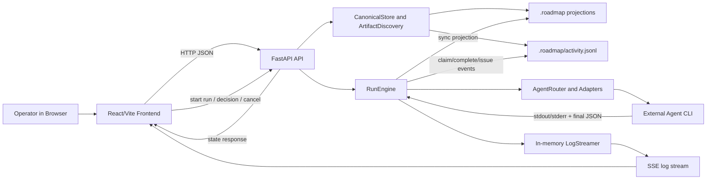

# SEC-002 Data Flow Diagram

## Data flow overview

## Detailed flows

### 1. Project discovery and state projection

1. Frontend calls `/api/v1/projects` or `/api/v1/projects/{project_id}/state`.
2. `routes_projects.py` and `routes_state.py` load the active project.
3. `CanonicalStore` reads `roadmap.json`, `issues.json`, `lessons.json`, and the tail of `activity.jsonl`.
4. `ArtifactDiscovery` classifies `.roadmap` files for the UI artifact catalog.
5. Backend returns consolidated state to the frontend.

Data objects:

- Project metadata
- Roadmap variants
- Task rows and eligibility status
- Open issues and lessons
- Artifact catalog
- Recent activity events

### 2. Manual run execution

1. Frontend calls `/runs/next` or `/runs/task`.
2. Backend validates eligibility using `EligibilityEngine` and `TaskSelector`.
3. `RunEngine` acquires the project lock.
4. If the task status is `todo`, `RunEngine` writes a `claim` event to `activity.jsonl`.
5. `Projector` syncs the selected roadmap, issues, and lessons projections to disk.
6. `RunEngine` builds `TaskContext` and prompts the chosen adapter.
7. Adapter invokes the external CLI and captures stdout/stderr.
8. Adapter extracts the final JSON action and normalizes it to `claim`, `complete`, or `issue.report`.
9. Backend pauses for manual decision.
10. On apply, backend appends canonical event(s) and projects state back to disk.

Data objects:

- Task context
- Active lessons
- Agent prompt
- Agent JSON result
- Decision history
- Canonical events

### 3. Artifact reading

1. Frontend calls `/projects/{project_id}/artifacts/content`.
2. Backend resolves the artifact path against either project root or `.roadmap` root.
3. Backend reads bytes, applies preview/full limits, decodes UTF-8, and returns content.

Data objects:

- Artifact path
- Decoded content
- Encoding metadata
- Truncation flag

### 4. Live log streaming

1. Frontend subscribes to `/logs/stream/{run_id}`.
2. `LogStreamer` replays buffered logs and pushes future log entries through asyncio queues.
3. `routes_logs.py` exposes logs as SSE events.

Data objects:

- System logs
- Agent stdout/stderr lines
- Run progress messages

## Trust-boundary annotations

### Flow A: Browser to API

- Boundary crossed: external client input enters server logic.
- Sensitive operations: run start, decision apply, task reset, issue resolve, integrity repair.

### Flow B: API to `.roadmap`

- Boundary crossed: server mutates canonical project state on disk.
- Sensitive operations: append to `activity.jsonl`, rewrite projections, resolve issues, mutate tasks through orchestrator events.

### Flow C: API to external agent CLI

- Boundary crossed: server hands task context and prompt to a subprocess and consumes untrusted output.
- Sensitive operations: command execution, parsing final JSON, handling malformed or failed runs.

### Flow D: API to artifact file reads

- Boundary crossed: API opens arbitrary project files within normalized roots.
- Sensitive operations: file content exposure and path resolution.

## Security-relevant observations

- The authoritative lifecycle is event-driven: projection files are derived state.
- Manual approval is the main guardrail between agent output and persistent mutation.
- Run logs are ephemeral in memory and not part of the canonical event store.
- The PoC currently lacks authentication, so any local client that can reach the API sits on the same trust plane.
